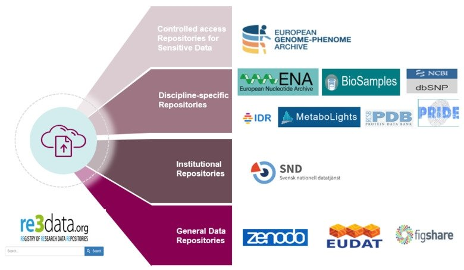
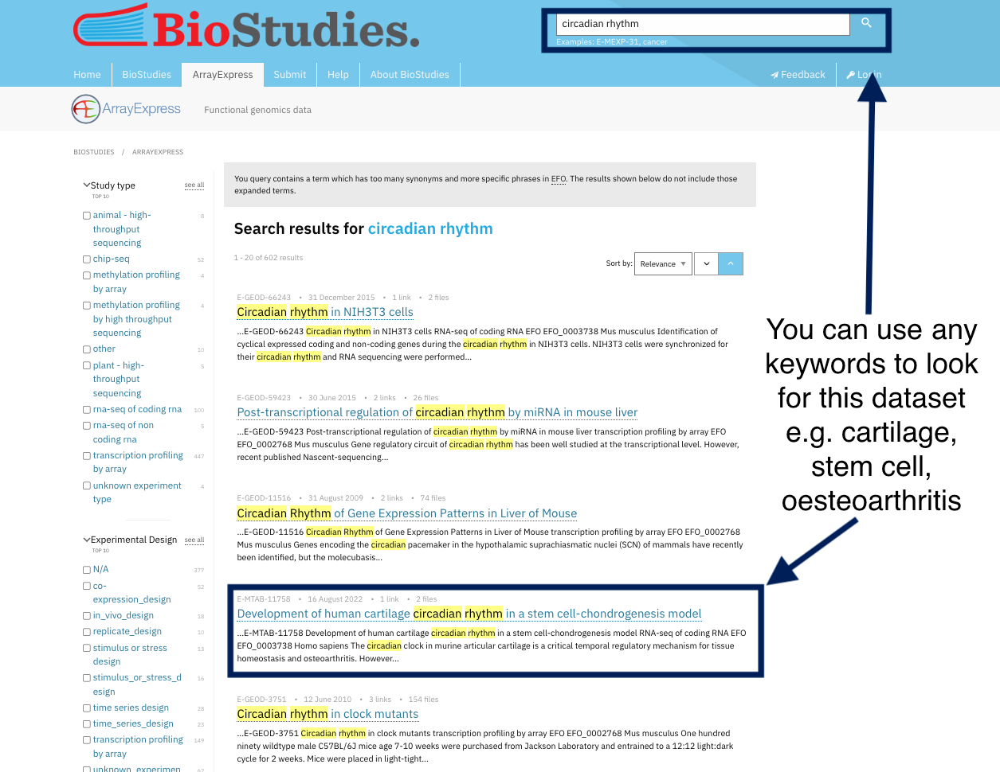
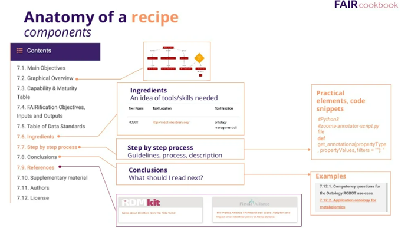

---
title: Registration
teaching: 20
exercises: 20
questions:
- What is a data repository?
- What are types of data repositories?
- Why should you upload your data to a data repository?
- How to choose the right database for your dataset?
objectives:
- Define what is data repository.
- Illustrate the importance of indexed data repository
- Summarize the steps of data indexing in a searchable repository
keypoints: 
- This episode adresses (F4) FAIR principle - (Meta)data are registered or indexed in a searchable resource
- This episode adresses (R1.1) FAIR principle - (Meta)data are released with a clear and accessible data usage licence
--- 
#### What is a data repository?
It is a general term used to describe any storage space you use to deposit data, metadata and any associated research. Please note that database is more specific and it is mainly for the storage of your data. 
###### Types of data repository
Data repositories are classified based on **the purpose of data repository** into:

A) Controlled access repository for sensitive data: explained in details in [data sharing lesson of RDMkit](https://rdmkit.elixir-europe.org/sharing) and we will explain this type of repository in the next episode

B) Discipline specific repository: there are known repository for different data types e.g [ArrayExpress](https://www.ebi.ac.uk/biostudies/arrayexpress) for high-throughput functional genomics experiments

C) Institutional repository: In case you can not find suitable repository for your data set, some universities have their own general purpose repositories. For instance, [University of Reading Research Data Archive](https://researchdata.reading.ac.uk) is a general purpose repository that have similar features e.g. controlled access ... etc to other databases. It can be used for students and researchers.

D) General data repository: multidisciplinary or/and general-purpose open data repository, open for all scholars  e.g. [zenodo](https://zenodo.org)

**Figure 1 summarizes these types with different examples**

### Why should you upload your data to a data repository?

To ensure data findability, your data should be uploaded to a public repository where it can be searched and found, This will make it comply with the fourth principle of findability (F4) which states that **(Meta)data are registered or indexed in a searchable resource**. 
Examples of these databases are  [ArrayExpress](https://www.ebi.ac.uk/biostudies/arrayexpress) for high-throughput functional genomics experiments. These databases have a set of rules in place to make sure that your data will be FAIR. After you upload your data into this database, they are assigned an ID and are indexed. Indexing helps researchers find your data by using persistent identifiers, keyword or even the name of researcher.

Take a look at the [ArrayExpress](https://www.ebi.ac.uk/biostudies/arrayexpress) database where all datasets are indexed, and you can simply find any dataset using the search tools. By indexing data, you can get the dataset using any keyword other than the PID. For example, if you want to locate **human NSCL cell** lines, you can just type this into the search toolbox. Use different keywords like **cartilage, stem cells and oesteoarthritis** and you will find the same dataset. Indexing and registering datasets, also means they are curated in such a way that you may discover them using different keywords. You can find the same dataset by using its identifiers or by using keywords chosen by the dataset's authors to describe it.

> ## Exercise 1: Indexing dataset in the data repository
> [FAIRcookbook](https://faircookbook.elixir-europe.org/) is an online open resource wth quick know-how (recipes) that help you to make and keep your data > > FAIR. Among others it includes information about how to index dataset general data-repositories. 
> The building unit of FAIR cookbook is called a recipe, The recipe is the term used to describe instructions for how to FAIRify your data. As you see in the > image, the structure of each recipe includes these main items **Figure 2**:
> 1- Graphical overview which is the mindmap for the recipe
> 2- Ingredients which gives you an idea for the skills needed and tools you can use to apply the recipes
> 3- The steps and the process
> 4- Recommendations of what to read next and references to your reading
> 
> Please use **FAIRcookbook** to find out and discuss required steps on how to obtain index for your dataset?
> When navigate the homepage of FAIRcookbook, you will find different tabs that covers each of FAIR 
> principles, so for instance, if you want recipes on **Accessibility** of FAIR, you will find all recipes 
> that can help you make your data accessible. 
> For a quick overview, you can also watch our RDMBites on FAIRcookbook [FAIRcookbook RDMBites](https://drive.google.com/drive/folders/16XZtCWBR-F3cvDHkB7A8jkjj6wvQ7sOr) 
>> ## Solution
>> - **Follow the following steps to find the recipe:**
>> 
>> 1- In this exercise, we are looking for a recipe on **indexing or registering dataset in a searchable 
>> resource** which you can find it in the findability tab, **Can you find it in this picture?**
>> 
>> 
>> 2- Click on the findability tab
>> 
>> 3- on the left side, you will find a navigation bar which will help you find different recipes that make 
>> your data **findable**. 
>> 
>> 
>> 4- As you can see here, you will find a recipe on registering datasets with Wikidata and another one on 
>> depositing to generic repositories-Zenodo use case
>> **Once you click on one of these resources, you will find the following:**
>> 
>> A) Requirements to apply the recipe to your dataset
>> B) The instructions 
>> C) References and further readings
>> B) Authors and licence
>> 
>> 
>> In our specialized courses, we will give you examples on how to upload your data to discipline specific repository
> {: .solution}
>
{: .challenge}

### Uploading your data to a database will make your data visible through the following:
1- Databases assign a unique persistent identifier to your data.

2- Your data will be indexed and curated, making it easier to find.

3- Some databases make it simple to connect your dataset to other datasets and link metadata to other dataset  **linked metadata**

4- Dataset licencing, with some databases offering controlled or limited access to protect your data.

**By uploading data to a database, you comply with the following FAIR principles**
- **F1** (Meta)data is assigned a globally unique and persistent identifier
- **F3** Metadata clearly and explicitly include the identifier of the data they describe
- **F4** (Meta)data is registered or indexed in a searchable resource
It will also allow your data to be more accessible as the standardized communications protocol and authentication are automatically set for your data
- **A1** (Meta)data is retrievable by their identifier using a standardised communications protocol
- A1.1 The protocol is open, free, and universally implementable
- A1.2 The protocol allows for an authentication and authorisation procedure, where necessary
- **A2** Metadata is accessible, even when the data is no longer available
- **I3** (Meta)data include qualified references to other (meta)data
- **R1.1** (Meta)data is released with a clear and accessible data usage license

> ## Exercise 2: Choosing the right database for your  dataset
> [FAIRsharing](https://fairsharing.org/) hels researchers identify the suitable data repositories, standards and policies for their data. It also contains > > the latest policies from from governments, funders and publishers for FAIRer data.
> Please use **FAIRsharing** to identify data-repositories for plant genomes? Think about one other example of domain-specific dataset, Identify and discuss data-reposity for it?
>
>> ###Solution
>>The following short video shows process of identifing sutitable data repository for plant genomes using FAIRsharing**
>> 
> {: .solution}
>
{: .challenge}

> ## Resources
> 
> - FAIRcookbook recipe on [Depositing to generic repositories- Zenodo use](https://faircookbook.elixir-europe.> org/content/recipes/findability/zenodo-deposition.html)
> - FAIRcookbook recipe on [Registering Datasets in Wikidata](https://faircookbook.elixir-europe.org/content/
> recipes/findability/registeringDatasets.html)
> - RDMkit guidelines on [Data publications and depostion](https://rdmkit.elixir-europe.org/data_publication)
> - RDMkit guidelines on [Finding and reusing existing data](https://rdmkit.elixir-europe.org/existing_data)
> - FAIRcookbook recipe on [Search engine optimization](https://faircookbook.elixir-europe.org/content/recipes/> findability/seo.html)
> - FAIRsharing offers a nice portal to different [examples of databases](https://fairsharing.org/search?> 
> fairsharingRegistry=Database&subjects=life%2520science&page=1)
{: .callout}
