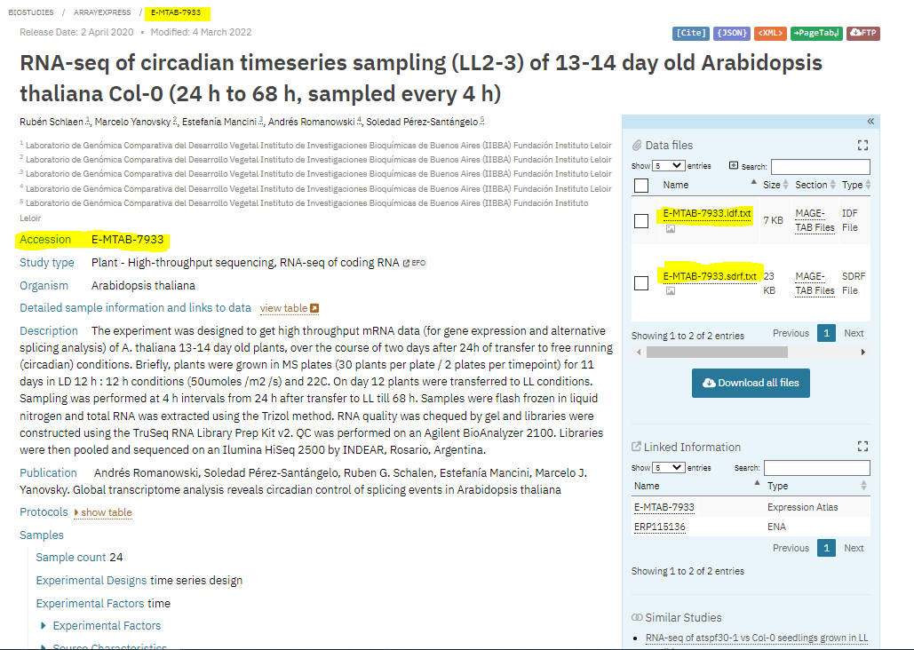

---
title: Persistent identifiers
teaching: 40
exercises: 10
questions:
- What is a persistant identifiers?
- What is the structure of identifiers?
- Why it is important for your dataset to have an identifiers?
objectives:
- Explain the definition and importance of using identifiers
- Illustrate what are the persistent identifiers
- Give examples of the structure of persistent identifiers
keypoints:
- (Meta)data use a formal, accessible, shared, and broadly applicable language for knowledge representation (I1)
- (Meta)data include qualified references to other (meta)data (A3)
- Metadata are accessible, even when the data are no longer available (A2)
--- 

## Persistent identifiers

Identifiers are a long-lasting references to a digital resources such as datasets and provides the information required to reliably identify, verify and locate your research data. Commonly, a persistent identifier is a unique record ID in a database, or unique URL that takes a researcher to the data in question, in a database.

That resource might be a publication, dataset, or person.   Persistent The identifiers have to be unique, globally only your data are identified by this ID that is never used by anyone in the whole world. In addition, these IDs and must not do not become invalid over time.
Watch our RDMbBites on the persistent identifiers to understand more.   

Identifiers are very important concept of the FAIR principle. They are considered one of the pillars for the FAIR principles. It makes your data more **Findable (F)** 

> ## Find the PID
> Remember our example on metadata types from arrayexpress, you can find it [in the first lesson](https://
> saramorsy.github.io/FAIR/02-ep.html), can you tell what is the persistent identifier of this dataset?
> {: .challenge}

> ## Solution
> The PID in this case or as it called in array express "Accession" is **E-MTAB-7933**. If you use this 
> accession number, you will find the dataset. 
> **In addition, have you noticed that also the data files are named using this PID** .
> {alt='alt text'}
> {: .solution}

**It is important to note that when you upload your data to a public repository, the repository will create this ID for you automatically.**

## the Structure of persistent identifiers

As you can see in this picture, the structure of any identifiers consist of 
1- The initial resolver service: domain which is unique and specific to each community e.g. ORCID for researchers and DOI for publications
2- **Prefix**: Unique number that represent category e.g. for DOI specific numbers refer to the publisher and directory
3- **Suffix**: The unique dataset number and it is unique under its prefix

> ## Resources
> The resources listed below provide an overview of the information you need to know about identifiers.
> - [Unique and persistent identifiers](https://faircookbook.elixir-europe.org/content/recipes/findability/
> identifiers.html): this link provide a nice and practical explanation of the unique and persistent identifiers > from FAIRCookbook 
> 
> - [Identifiers](https://rdmkit.elixir-europe.org/identifiers.html): another nice explanation from RDMkit
> 
> - [Machine actionability](https://rdmkit.elixir-europe.org/machine_actionability): identifiers are also 
> important for machine readability, a nice explanation from RDMkit that describes machine readability
> 
> - Examples and explanation of different identifiers from FAIRsharing.org https://fairsharing.org/search?
> recordType=identifier_schema

{: .callout}

