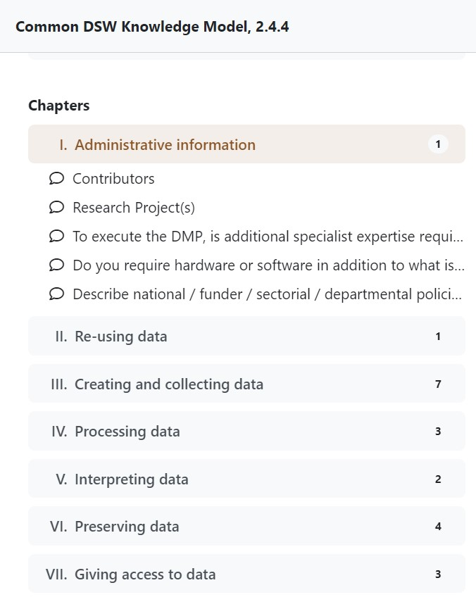
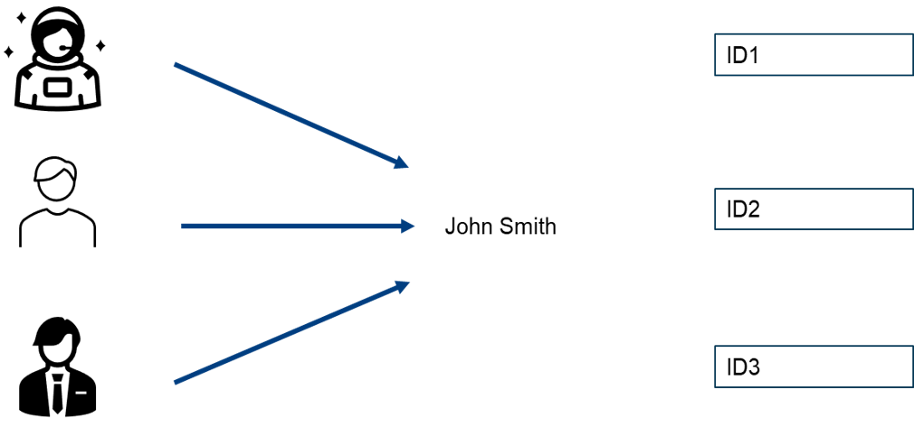
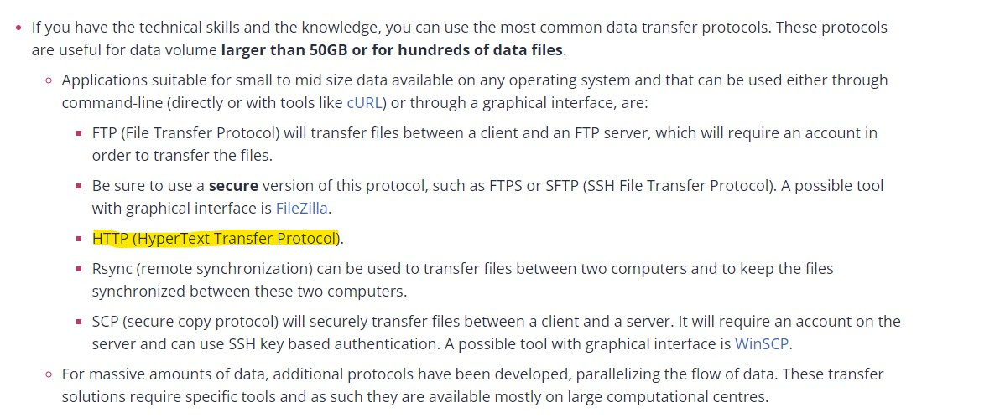

---
title: Access
teaching: 40
exercises: 10
questions:
- What is protocol and authentication?
- What are the types of transfer protocols?
- What is data usage licence?
- What is sensitive data?
objectives:
- To illustrate what is the communications protocol and the criteria for open and free protocol
- To give examples of  databases that uses a protocol with  different  authentication process 
- To interpret the usage licence associated with different data sets
keypoints:
- This episode adresses (A1) FAIR principle - (Meta)data are retrievable by their identifier using a standardised communications protocol
- This episode adresses (R1.1) FAIR principle - (Meta)data are released with a clear and accessible data usage licence
--- 
### Access to the data
When you plan your research project, you have to determine who can have access to your data, how you will provide the access and under what condition?  You should not wait after data collection to start thinking about the access to your data.  A good staring point is to consider what are different types of data access?

###### Types of access
**there are four types of data access as explained by [RDMkit](https://rdmkit.elixir-europe.org/sharing#what-should-be-considered-for-data-sharing):**
- Open access: Any one can access the data
- Registered access or authentication procedure: researchers have to register and go through process of authentication to have the right to access the data
- Controlled access or Data Access Committees (DACs): researchers who wants access to your data will apply and their application will be reviewed by a data access committee who will assess the application and make sure that resaerchers will abide by the criteria you have specified
- Access upon request (not recommended): you provide your contact details for any researcher who can contact you to get access to your data. Contact details should be provided in the metadata which is made publicly available.

To get more detailed explanation, check RDMkit explanation of [data sharing](https://rdmkit.elixir-europe.org/sharing#what-should-be-considered-for-data-sharing)

> ## Exercise 1: Data access types factors
> "Data stewardship wizard" is an online tool that provides guidelines on the process of writing DMP for your research project. It uses a knowledge model, which includes information about what questions to ask  and how to ask them based on the needs of the research field or organisation.
> The knowledge model covers seven chapters:
> - Administrative information
> - Re-using data
> - Creating and collecting data
> - Processing data
> - Interpreting data
> - Preserving data
> - Giving access to the data
> 
> 
> 
> For each of these **topics**, we have a set of questions that helps you write your DMP. For each question, there are tags that help you know funding bodies questions (Figure 2)
> 
> **DSW Wizard** has a full chapter on writing access plan.
> 
> Imagine you are a principle investigator writing data access plan, what are the factors you need to consider to determine the type of access for your data?
>> ## Solution
>Use  **How to choose the right data access plan for you?** of **DSW Wizard**
>> Based on DSW, there are main four questions
>> - Will you be working with the philosophy 'as open as possible' for your data?
>> - Can all of your data become completely open over time?
>> - Will you use temporary restrictions on the reuse of the data (embargo)?
>> - Will metadata be available openly?
>> For each of these questions, there is a follow-up questions based on your answer to the main question
> {: .solution}
{: .challenge}

One of things you have to consider in addition to the above criteria, is to determine **the data usage licence** for your data
### Data usage licence
This describes the legal rights on how others use your data. As you publish your data, you should describe clearly in what capacity your data can be used. Bear in mind that description of licence is important to allow machine and human reusability of your data. There are many licence that can be used e.g. MIT licence or Common creative licence. These licences provide accurate description of the rights of data reuse, Please have a look at resources in the description box to know more about these licences. 

{alt='alt text'}
> ## Exercise2: Data usage licence
> - From the this RDMkit guideline on types of [licence](https://rdmkit.elixir-europe.org/licensing), what is the licence used by the following datasets:
> 1- [A large-scale COVID-19 Twitter chatter dataset for open scientific research - an international > collaboration](https://zenodo.org/record/7368547#.Y4TjT3bP02w)
> 2- [RNA-seq of circadian timeseries sampling (LL2-3) of 13-14 day old Arabidopsis thaliana Col-0 (24 h to 68 > h, sampled every 4 h)](https://www.ebi.ac.uk/biostudies/arrayexpress/studies/E-MTAB-7933)
>> ## Solution
>> The link we provided, provided a nice explanation on types of licence and as you read the following section, you will find the following part:
>> {alt='alt text'}
>> From this section, you can clearly understand the type of licence used for:
>> 1- [A large-scale COVID-19 Twitter chatter dataset for open scientific research - an international 
>> collaboration](https://zenodo.org/record/7368547#.Y4TjT3bP02w) is CC-BY-4
>> 2- [RNA-seq of circadian timeseries sampling (LL2-3) of 13-14 day old Arabidopsis thaliana Col-0 (24 h to 68 > h, sampled every 4 h)](https://www.ebi.ac.uk/biostudies/arrayexpress/studies/E-MTAB-7933) is CC-BY-4
> {: .solution}
{: .challenge}

**As you are uploading your data to a data repository, the following definitions are important for you to understand the type of access. Communication protocol and authentication are used by different databases to protect your data and control access to your data**

#### Standard communication protocol
Simply put, **a protocol** is a method that connects two computers, the protocol ensure security, and authenticity of your data. Once the safety and authenticity of the data is verified, the transfer of data to another computer happens.

Having a protocol does not guarantee that your data are accessible. However, you can choose a protocol that is free, open and allow easy and exchange of information. One of the steps you can do is to choose the right database, so when you upload your data into database, the database executes a protocol that allows the user to  load data in the user’s web browser. This protocol allows the easy access of the data but still secures the data. 

#### Authentication process
It is the process that a protocol uses for verification. To know what authentication is, suppose we have three people named John Smith. We do not know which one submitted the data. This is through assigning a unique ID for each one that is interpreted by machines and humans so you would know who is the actual person that submitted the data. Doing so is a form of authentication and this is used by many databases like Zenodo, where you can sign-up using ORCID-ID allowing the database to identify you.

> ## Exercise3:  Authentication protocol
> After reading RDMkit guidelines on different [protocol types](https://rdmkit.elixir-europe.org/data_transfer.
> html#how-do-you-transfer-large-data-files), do you know what is the protocol used in [arrayexpress](https://www.ebi.ac.uk/biostudies/arrayexpress)?
>> ## Solution
>> As we explained before on how to use the RDMkit, going through the [Protocols and safety of data transfer](https://rdmkit.elixir-europe.org/data_transfer.html), you will find different types of protocols explained
>> 
>> From this part, you can understand that the protocol used for the arrayexpress is **HTTP (HyperText Transfer Protocol)** (highlighted in yellow) >> in the following figure
>> 
> {: .solution}
{: .challenge}

### Sensitive data 
Sensitive data are type of data that, if made publicly available, could cause consequences for individuals, groups, nations, or ecosystems and need to be secured from unauthorised access. To determine whether your data is sensitive, you should consult national laws, which vary by country.

If your data is following this definition, you have to de-identify your data. **Data deidentification** is a process through which data cannot be identified through the study team nor the users of the data.

- It includes two processes:

1- Data anonymization

2- Data pseudonymization

> ## Exercise 4: Data anonymization and pseudonymization
> - From the this RDMkit guideline on [Sensitive data](https://rdmkit.elixir-europe.org/sensitive_data), can you out find what is the data anonymization and data pseudonymization?
>> ## Solution
>> The link we provided, provided a nice explanation on sensitive data and as you read the following section 
>> from RDMKit, definitions are the following:
>> **Data anonymization** is the process of irreversibly modifying personal data in such a way that subjects 
>> cannot be identified directly or indirectly by anyone, including the study team. If data are anonymized, no > one can link data back to the subject.
>> 
>> **Pseudonymization** is a process where identifying-fields within data records are replaced by artificial 
>> identifiers called pseudonyms or pseudonymized IDs. Pseudonymization ensures no one can link data back to the subject, apart from nominated members of the study team who will be able to link pseudonyms to identifying > records, such as name and address.
> {: .solution}
{: .challenge}

If you are working with sensitive data, you have to declare the data permitted uses before using the data. In addition, if you are writing data management plan (DMP), you will have to mention the following:
- How will you collect the data?
- How is Data annonymization and pseudonymization handled?

To know what are the other steps you need to do and write, you can check DSW For sensitive data, the DSW have questions dedicated to describing the collection and processing of sensitive data

> ## Resources
> - A nice recipe from FAIRcookbook on [SSH protocols](https://faircookbook.elixir-europe.org/content/recipes/> accessibility/sftp.html)
> - A nice explanation from RDMkit on protocols and how they will help you protect your data[Protocols and 
> safety of data transfer](https://rdmkit.elixir-europe.org/data_transfer.html)
> 
> **Having your work licenced does not sound simple as it seems; here are some resources to help you find the > correct licence for you:**
> 
> - Why should you assign licence to your protocol from RDMkit [Licencing](https://rdmkit.elixir-europe.org/> licensing)
> - A recipe from FAIRcookbook with step-by-step instructions for 
>   - [licence](https://faircookbook.elixir-europe.org/content/recipes/reusability/ATI-licensing.html)
>   - [software licence](https://faircookbook.elixir-europe.org/content/recipes/reusability/ATI_licensing_software.> html)
>   - [Data licence](https://faircookbook.elixir-europe.org/content/recipes/reusability/ATI_licensing_data.html)
>   - [Declaring data permitted uses](https://faircookbook.elixir-europe.org/content/recipes/reusability/
> expressing-data-use.html)
> - To know more about creative common licence, check this link [Creative commons licence](https://
> creativecommons.org/choose/)
> 
> **To get more information on sensitive data, you can have a look on these reources:**
> 
> - [What is sensitive data?](https://rdmkit.elixir-europe.org/sensitive_data)
> - [How to describe the permitted use of data](https://faircookbook.elixir-europe.org/content/recipes/
> reusability/expressing-data-use.html#)
> - [ELSI and GDPR](https://scilifelab-data-guidelines.readthedocs.io/en/latest/docs/general/sensitive_data.
> html)
> 
{: .callout}
